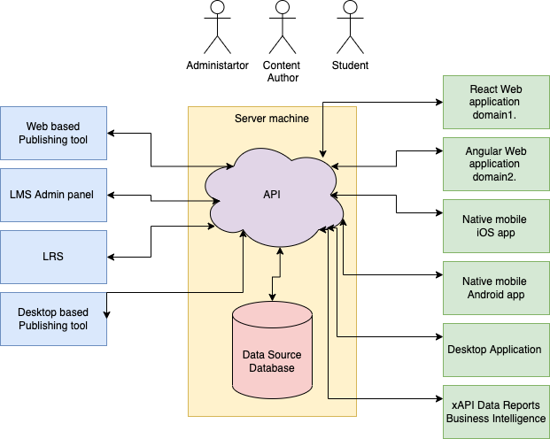

---
title:
  - `ulam` Headless Course Format
author:
  - Mateusz Wojczal <mateusz@wojczal.com>
papersize:
  - a4
fontsize:
  - 12pt
geometry:
  - margin=1in
fontfamily:
  - charter
output:
  pdf_document:
    fig_caption: yes
    keep_tex: yes
---

\pagebreak

Latest version of this document is available here: [PDF](https://escolalms.github.io/headless-format/paper.pdf), [web](https://escolalms.github.io/headless-format).

Current status of this paper is **proofread and edit**.

\hypersetup{linkcolor=black}
\tableofcontents

\pagebreak

# Glossary

**ADL**
Advanced Distributed Learning (ADL) Initiative from the Office of the United States Secretary of Defense.

**cmi5**
cmi5 is an xAPI Profile that provides rules defining how online courses are imported, launched and tracked using a Learning Management System (LMS) and xAPI.

**JSON**
JavaScript Object Notation (JSON) is a lightweight data-interchange format, that is both easy to read and write for humans and easy to parse and generate by machines.

**JSON Schema**
JSON Schema is a vocabulary that allows you to annotate and validate JSON documents.

**LMS**
Learning management system (LMS) is a type of software used for creation, administration and presentation of educational courses and their contents.

**LRS**
A Learning Record Store (LRS) is a data store system that serves as a repository for learning records collected from connected systems where learning activities are conducted.

**Monolith architecture**
In software engineering, a monolithic application describes a single-tiered software application in which the user interface and data access code are combined into a single program from a single platform.

**PWA**
A progressive web application (PWA), is a type of application software delivered through the web, built using common web technologies, employing the progressive enhancement web development strategy (allowing everyone to access the basic content and functionality of the app, while users with additional browser features or better devices receive the enhanced version instead). It is intended to work on any platform that uses a standards-compliant browser, including both desktop and mobile devices.

**SCORM**
Shareable Content Object Reference Model (SCORM) is a set of technical standards for eLearning software products.

**Separation of concerns**
In computer science, separation of concerns (SoC) is a design principle for separating a computer program into distinct sections, each of which addresses a separate concern.

**SPA**
A single-page application (SPA) is a web application or website that interacts with the user by dynamically rewriting the current web page with new data from the web server, instead of the default method of a web browser loading entire new pages.

**xAPI**
The Experience API (xAPI) is an e-learning software specification that allows learning content and learning systems to speak to each other in a manner that records and tracks all types of learning experiences.

**XML**
Extensible Markup Language (XML) is a markup language for coding documents, that allows designers to create their own customized tags for structuring document contents. XML is widely used as a data-interchange format in web services.

**ZIP**
ZIP is an archive file format that supports lossless data compression.

\pagebreak

# The Abstract

Current e-learning software comes with a huge technological debt and does not respond to market needs as fast as other IT segments can. The main reason is dependency on obsolete formats like SCORM that are still widely used, and which do not separate data layer from the presentation layer. There is a need from market for existence of better designed and better implemented formats.

\pagebreak

# The Introduction

Current e-learning formats do not separate data from presentation layers. Current e-learning content is not portable and is not designed to age well.

With separation of layers the content could be presented in a modern way every time a new device is introduced. If SCORM courses were designed in this fashion back in 2000s it would be straightforward to convert them to any of commonly used devices, like smartphones, smartwatches, smart TVs, and anything else capable of running current software. But because of a few wrong design decisions made without necessary foresight, we are now stuck with this format and with obsolete courses.

Back in the days when Advanced Distributed Learning was creating SCORM (adapting older AICC HACP desktop format) there was little variance in commonly available devices capable of interacting with eLearning software - most personal computers used the same web browser, same operating system and had similar displays with common 1024x768 pixel resolution. If there were any exceptions, they were minimal and negligible. Browsers were not able to do much more than to show server response in HTML format after (synchronous) client request. Everything displayed in browser window was rendered by server, and even if there was any separation of layers, it existed only on the server side.

Organizations that are working on e-learning standards are responding to market needs very slowly. Their latest specification `cmi5`, which does solve many of the shortcomings of previous standards, is already 6 years old and not commonly adopted - the most popular format SCORM 2004 4th Edition was published in 2009.

The headless approach seems to be solving all of the issues that modern e-learning and LMSes do have. The separation of content and it's players allows to create courses that works well on any device and do age well. Courses designed in this favour most likely will be able to be played on smart devices not yet in existence.

\pagebreak

# Evolution of e-learning

## E-learning Content Granularity

Before describing courses, content and related formats we should explicitly describe what does each of the following keywords means.

- **Course** is an shareable independent peace of packed sequenced interactive multimedia elements that connect (two way communication) with LMS to track user interactivity

- **Packaging** is a way of packaging course into one file that can be shareable between LMSes

- **Importing** is a process of importing course from the package

- **Exporting** is a process of creating the package

- **Asset** is a small pieces of course content which are not intended to be consumed alone, eg. image, video, audio files.

- **Resource** is a learning resource that can be consumed by a learner to get a specific knowledge or develop a simple competency. A resource synonym is **Lesson** or **Article**

- **Aggregations** is a set of resources organized in a specific way. Synonym is sometimes Course, but this is misleading as Course is a bigger entity.

- **Sequencing** is a way to describe sequence of resources with tracking meta description.

## History of e-learning formats

The most popular e-learning formats are created and managed by the Advanced Distributed Learning (ADL) Initiative from the Office of the United States Secretary of Defense.

Before e-learning was used in the web browser environment there was AICC’s format created in 1993. First widely used format was AICC HACP (released in 1998) which later evolved into SCORM 1.0 that was released in year 2000.
Since then, up to the latest SCORM 2004 4th Edition version (released in 2009) it is the most popular and adopted collection of standards and specifications for web-based e-learning.

SCORM (which is an abbreviation of Sharable Content Object Reference Model) describes communication between client side content and a host system, and describes package structure, defining how whole course, consisting of resource files and XML manifest can be packaged into ZIP archives that are called "Package Interchange Format"[^1].

Since SCORM has many shortcomings, The Experience API, also known as Tin Can API or `xAPI` was released, and later cmi5 format was created, providing a set of rules intended to achieve interoperability in a traditional Learning Management System environment.

xAPI specification removes content for it description, and allows the content to send “statements” based around [actor] [verb] [object], or “I – did – this” to a Learning Record Store (LRS) which can be a part of a Learning Management System, but can also live on its own, or as part of another separate system.

\pagebreak

The table below [^2] summarizes the comparison of each standard:

|           Format           |    Released    | Pages |   Widely Used    | Run-Time | Pack-aging | Meta-data | Sequen-cing | Works Cross Domain |
| :------------------------: | :------------: | :---: | :--------------: | :------: | :--------: | :-------: | :---------: | :----------------: |
|         AICC HACP          |    Feb 1998    |  337  |       Yes        |   Yes    |    Yes     |    No     |     No      |        Yes         |
|         SCORM 1.0          |    Jan 2000    |  219  |        No        |   Yes    |    Yes     |    Yes    |     No      |         No         |
|         SCORM 1.1          |    Jan 2001    |  233  |        No        |   Yes    |    Yes     |    Yes    |     No      |         No         |
|         SCORM 1.2          |    Oct 2001    |  524  |       Yes        |   Yes    |    Yes     |    Yes    |     No      |         No         |
|  SCORM 2004 “1st Edition”  |    Jan 2004    | 1,027 |        No        |   Yes    |    Yes     |    Yes    |     Yes     |         No         |
|   SCORM 2004 2nd Edition   |    Jul 2004    | 1,219 |       Yes        |   Yes    |    Yes     |    Yes    |     Yes     |         No         |
|   SCORM 2004 3rd Edition   |    Oct 2006    | 1137  |       Yes        |   Yes    |    Yes     |    Yes    |     Yes     |         No         |
|   SCORM 2004 4th Edition   |    Mar 2009    | 1162  |       Yes        |   Yes    |    Yes     |    Yes    |     Yes     |         No         |
|    IMS Common Cartridge    |    Oct 2008    |  135  |        No        |    No    |    Yes     |    Yes    |     No      |        Yes         |
|          IMS LTI           |    May 2010    |  25   | In Academic LMSs |   Yes    |     No     |    No     |     No      |        Yes         |
| The Experience API (xAPI)  | April 26, 2013 |  85   |     Not Yet      |   Yes    |  Partial   |    No     |     No      |        Yes         |
| cmi5 (a companion to xAPI) |  June 1, 2016  |  48   |     Not Yet      |   Yes    |    Yes     |    No     |     No      |        Yes         |

## What is Learning Management System - LMS

> A learning management system is a software application for the administration, documentation, tracking, reporting, automation, and delivery of educational courses, training programs, or learning and development programs. The learning management system concept emerged directly from e-Learning.

The most popular LMS in the world is Moodle [^3], released on 20 August 2002, as Open Source software, distributed under the GNU General Public License, which is probably one of the reasons of its popularity.

Moodle is an application written in PHP that is being served by a machine that uses PHP. That means that all of the actions for administrators, course creators, students and any other roles does require to connect to the hosting machine (server) that serves Moodle. This is an example of monolith architecture, which means that all Moodle components are PHP based working on one machine that parses moodle source code every time there is a request from the browser. Components of the program are interconnected and interdependent in a tightly-coupled architecture.

Most other popular LMS work very similarly, as the monolith architecture is the most prevalent design among available LMS software.

## LMS Monolith Architecture

The diagram below show Moodle monolith architecture


All the LMS Features, including

- Managing courses, users and roles
- Online assessment
- User feedback
- Synchronous and Asynchronous Learning
- Learning Analytics

are handled directly from the server, the response is prepared before being sent in HTML format by PHP preprocessor, and the client gets the final rendered HTML document.


All the above means that Moodle and dedicated server is required all the time for all e-learning activities.

## Process of publishing the course

Standard way of creating and publishing SCORM compliant course is described by these four steps:

1. Creating of a course in an e-Learning authoring tool (like Adobe Captivate [^4]) or using tools integrated with the LMS software
2. Course is published as a SCORM package (a ZIP file)
3. SCORM package is being uploaded to the LMS, using an upload form, and is prepared to be published
4. LMS publishes the course to the students; all results of activities are stored in the LMS


The process above is one directional - which means that SCORM package is a closed format, once published it cannot be edited.
In order to make any changes, even correcting simple typo, the whole process must be repeated - course needs to be changed in authoring tool, packaged into zip, then uploaded and (re)published.

## Introduction of Experience API (xAPI) and related technologies

One of the shortcomings of SCORM that influenced the introduction of extended formats was the limitation of capability to track and analyse activities of students to only data available within the same LMS.

That means that the course, LMS and student progress were inseparable.

xAPI specification removes content for it description, and allows the content to send “statements” based around [actor] [verb] [object], or “I – did – this” to a Learning Record Store (LRS) which can be a part of a Learning Management System, but can also live on its own (or as a part of another, separate, system). This was the first step for **Separation of concerns** in e-learning.

### Learning Record Store (LRS)

A Learning Record Store is an application, external to course runtime, that receives and sends data in JSON format from and to the course runtime - it is an essential component in Experience API process flow. What is a big difference from previous e-learing standards, is that the specification does not tell how the course should be played (how course runtime should work), it just defines how the runtime must communicate with the interface (LRS) though xAPI Statements. The statements are open to be extended and each implementation can introduce its own statements.


### cmi5 Specification

> cmi5 is a "profile" for using the xAPI specification with traditional learning management (LMS) systems. [^6]

The specification of cmi5 is a set of rules providing all the capabilities of SCORM and xAPI.
It is similar to SCORM in a way, as it also requires a XML file manifest, yet it does introduce the Assignable Unit (AU) - separately launchable learning content presentation. The AU is the unit of tracking and management. The AU collects data on the learner and sends it to the LMS (through an LRS).

![Conceptual Overview of cmi5 [^5] ](images/cmi5-concept-overview.png)

cmi5 also requires Determine Launch Mode, defining some xAPI statements that must appear in correct order.
The course itself describes `moveOn` rules

> Setting that captures how a learner moves through the AUs/Blocks of a Course. Determines what is required for an AU to be considered “Satisfied”. Blocks are “Satisfied” when all of their direct descendent AUs or Blocks are “Satisfied”. The Course is “Satisfied” when all of its direct descendent AUs or Blocks are “Satisfied”. [^6]

![cmi5 Implementation Flow for an LMS [^7] ](images/lms-flow-chart.png)

### Limitations parts of current standards

Regardless of all the efforts for evolution of e-learning standard there are still limitations:

- SCORM is limited by design, there is no way to improve it implementing **Separation of concerns** design pattern.
- Even with latest standard `cmi5` the **Separation of concerns** is not complete.
- Assignable Unit defines only entry URL for the content, but it does not define the content structure in any way.
- Specification of Assignable Unit (AU) require to have `launchURL` that basically is course starting point. There is no way to extend this to replace `launchURL` with the content itself.
- There is no separation of layers in content delivery. Presentation, data and logic layers are inseparable.
- Courses cannot be played offline as server is required all the time.
- Even though cmi5 provides **Mobile app launch support** functionality there is no specification for that, it is possible yet not defined.

\pagebreak

# Separation of concerns

The main motivation of introducing new e-learning format is to allow to separate all of the e-learning components into independent elements and follow the **separation of concerns (SoC)** computer science design principle.

> A design principle for breaking down an application into modules,
> layers, and encapsulations, the roles of which are independent of one
> another. [^8]

## Headless

Regular design of websites and web application intertwines back-end (server side component) and front-end (graphical user interface), by having back-end serve prerendered content in form of html pages and/or by having the back-end decide which content to serve (routing).

Headless web application is an implementation of **separation of concerns (SoC)** design principle, decoupling front-end and back-end, ensuring that the front-end can exist as a stand-alone piece of software, and that the back-end does not know (and has no reason to know) anything about the way the data that it serves will be presented. All the communication happens through APIs as the bridge between both layers.

### Headless LMS.

In opposition to Monolith LMS Architecture, a Headless LMS is build upon API as a main component. All other components communicate though this interface. In most cases API and Database are the only parts that require dedicated server.

In Monolithic architecture, frontend component, a presentation layers, requires specific know-how, for example you are obliged to use Moodle template system called Mustache when working with MoodleLMS.

In Headless architecture, frontend is not determined by backend in any way, and is framework agnostic. You can use any frontend frameworks and technologies you want. Furthermore you can create multiple frontend solutions working with same backend, for example a React app for Learners on one domain, a Vue app for Admins on other domain, and another sepearate Learner app for mobile devices.

**Headless LMS Architecture**

- **separation of concerns (SoC)** design principle, separate all of the components
- decoupled architecture (separate frontend and backend)
- only API requires server
- admin panel can be serverless
- user app can be serverless
- application and admin panel are easy to replicate/scale
- other view layouts (eg native mobile application) are easy to add without changes to other layers
- to implement Courses for Students there is little to none required knowledge of specific backend implementation



A Headless LMS is a "Course Repository" that makes content accessible to any platform via an API. We provide blocks to build one, yet you’re free to change those and use your own.
Unlike a traditional LMS such as Moodle, a Headless LMS does not dictate where or how content is shown. Also you don’t need any additional software to show a course - it’s just a matter of API communication.

A Headless LMS enables teams to deliver omnichannel experiences at scale, globally, without restrictions like templates, devices, or pre-defined technologies.
A Headless LMS allows brands and companies to engage with users on any device and format. White label was never easier than with headless.
A Headless LMS fits into any preferred tech stack or framework, including most popular ones like React, Angular, and Vue.

## Limitations of current standards that Headless can improve

- Implementing **Separation of concerns** design pattern
- New headless formats can be defined with new course structure
- Presentation, data and logic layers are decoupled
- Courses can be played offline as communication with server is not required all the time
- New presentation methods and designs can be easily added without making changes to other layers, so for example **Mobile app launch support** functionality is relatively easy to achieve

## Content granularity of the formats

|             | SCORM                          | CMI5                                             | Headless format                |
| ----------- | ------------------------------ | ------------------------------------------------ | ------------------------------ |
| Assets      | All assets in the package      | either remote or local assets                    | All assets in the package      |
| Packaging   | ZIP Package with local resouce | ZIP package with either remote or local resurces | ZIP Package with local resouce |
| Resources   | Each SCO is Resource           | each AU is Resource                              | each Lesson is a Resource      |
| Aggregation | Made of items                  | Made of blocks                                   | Made of blocks                 |
| Sequencing  | XML Manifest                   | XML Manifest                                     | XML/JSON Manifest              |

# `ulam` Format.

Because of the shortcomings of existing standards of course content definitions, I thereby propose a new standard which I will call **`ulam`** or **Universal Learning Asynchronous Model**.

The main motivation for creation of the new standard are following:

**Separation content layer from presentation layer.**

All of the most popular e-learning format (and especially SCORM) mix view, data and logic layer into one inseparable whole.

New format must separate all the layers to follow separation of concerns (SoC) design principle.

**Use of JSON format instead of XML.**

When SCORM was published for the first time JSON format did not exists. During evolution of standards ADL used JSON for `xAPI`.
Compared to XML, JSON is lighter and easier to parse data format, requiring no additional code for parsing when used in JavaScript environment.
It is currently more popular then XML [^9]

New format must use JSON and JSON Schema.

**Easy implementation.**

SCORM format is complicated and was never easy for implementation, but nevertheless it is still the most popular standard.

And both `xAPI` and much newer `cmi5` still have very small adoption rates [^10].

New format must be not only easy to implement, but must be enticing for potential users to adopt.

**Format that is futureproof.**

SCORM did not age well.

There are many courses that were created in 2010s using obsolete Flash technologies, which are useless now, because none of the browsers support Flash Player anymore.

New format must be futureproof, and **Separation of concerns** design pattern is a solution for preventing future problems that SCORM faces, because it implies decoupling of Course raw data from Presentation.

**Simple, but open for extension.**

New format must be open for extensions, which means that it must be possible to implement new features without changing old ones.

**Standalone.**

New format package must be able to be played as course without any external services.

**Headless.**

The course itself does not know how it will be displayed for a student.

**Using well design standards, reject obsolete ones.**

**From SCORM**

- Content packaging as ZIP file
- Importing from ZIP
- Exporting as ZIP
- Sequencing

**From xAPI**

- usage of JSON Format
- xAPI Statements
- Learning Record Store

**From cmi5**

- Launch Method with `moveOn` Rules
- Manifest with blocks and Assignable Units (AU)
- 9 xAPI Verbs (Launched, Initialized, Completed, Passed, Failed, Abandoned, Waived, Terminated, Satisfied)

## Definition

The course is packed in ZIP file that contains `content.json` manifest in main folder.

The course itself consists of at least one lessons which consists of at least one topic. Topic is describes by type and value.


The manifest contains the following:

### General description of Course attributes

Course is defined by

| Attribute name |       type       |                                                  description                                                  | required |
| :------------: | :--------------: | :-----------------------------------------------------------------------------------------------------------: | -------- |
|       id       | number \| string | Unique ID of the course. Can be used to identify during import process whether this is a new course or update | no       |
|  description   |      string      |                                           Description of the course                                           | no       |
|     title      |      string      |                                              Title of the course                                              | yes      |
|   base_price   |      number      |                            Base price of the course. Value 0 means that it's free                             | no       |
|    lessons     |      array       |                                                List of lessons                                                | yes      |
|    language    |      string      |                    Unique ID of the language of the course. Preferred in ISO 639-1 format                     | no       |
|    subtitle    |      string      |                                            Subtitle of the course                                             | no       |
|    summary     |      string      |                                                    Summary                                                    | no       |
|    duration    |      string      |                     How long does the course take. Preferred in ISO 8601 duration format                      | no       |

_Apart of the above list of attributes, the course can be described by any number of additional fields._

### General description of Lesson attributes

| Attribute name | type             | description                                                                                                   | required |
| -------------- | ---------------- | ------------------------------------------------------------------------------------------------------------- | -------- |
| id             | number \| string | Unique ID of the course. Can be used to identify during import process whether this is a new lesson or update | no       |
| title          | string           | Title of the lesson                                                                                           | yes      |
| order          | number           | Sorting order                                                                                                 | no       |
| duration       | string           | How long does the lesson take. Preferred in ISO 8601 duration format                                          | no       |
| summary        | string           | Summary of the lesson                                                                                         | no       |
| topis          | array            | List of Topics                                                                                                | yes      |
| lessons        | array            | List of child Lessons                                                                                         | no       |

_Apart of the above list of attributes, the lesson can be described by any number of additional fields._

### General description of Topic attributes

| Attribute name |       type       |                                                 description                                                  | required |
| :------------: | :--------------: | :----------------------------------------------------------------------------------------------------------: | -------- |
|       id       | number \| string | Unique ID of the course. Can be used to identify during import process whether this is a new topic or update | no       |
|     title      |      string      |                                              Title of the topic                                              | yes      |
|     order      |      number      |                                                Sorting order                                                 | no       |
|    duration    |      string      |                     How long does the lesson take. Preferred in ISO 8601 duration format                     | no       |
|    summary     |      string      |                                            Summary of the lesson                                             | no       |
|    preview     |     boolean      |                      Can user preview this Assignable Unit without launching the course                      | no       |
|  description   |      string      |                                          Description of the lesson                                           | no       |
|      type      |      string      |                                                Type of Topic                                                 | yes      |
|     value      |      object      |                                   Value of the Topic depending on the Type                                   | yes      |

### Topic can he remote.

The topics itself can be remote just like `cmi5` AU items.

In case that topic is describe by string URL not by the object describing Topic then this is a remote topic.

### General description of Topic types

Topic is describes by type and value.

Topic type attribute is in string format with namespace, with default namespace `ulam`.

Topic type is an abstract type and polymorphic. This means that has different meaning based on the `type` value.

If the value of the Topic contains references (url) to assets (audio, video, images, etc), they must be placed
with relative paths to main `content.json` file.

### In the first version of the format, following Topic Types are specified:

#### Text

- Namespace: `ulam\text`
- Value: Unformatted text with newlines

#### RichText

- Namespace: `ulam\richtext`
- Value: Markdown formatted text with newlines

#### HTMLText

- Namespace: `ulam\html`
- Value: HTML document content

#### Audio

- Namespace: `ulam\audio`
- Value: Reference to Audio file

#### Video

- Namespace: `ulam\video`
- Value: Reference to Video file

#### PDF

- Namespace: `ulam\pdf`
- Value: Reference to PDF file

#### Image

- Namespace: `ulam\image`
- Value: Reference to Image file

#### H5P

- Namespace: `ulam\h5p`
- Value: Reference to H5P content

## Validating

The manifest must be validated against JSON Schema file. The latest schema is always available in github repository[^11].

## Extending

Apart of the listed attributes, the manifest can be extended by any number of additional fields.

For example, if there is a need to describe course by video path or image it is a matter of adding new fields to the course attributes.

### Topic Types

One of the most important motivation introducing new format was the ability to add without limits new type of Assignable Unit (AU) in `ulam` called TopicTypes.

Each organization that wants to add new type should use its own namespace for `type`.

This allows to add new topic types, for example:

- Augmented Reality assets
- 3D Models
- 3D Panoramas
- 3D Movies
- Metaverse assets
- Specialized format for particular industries
- etc.

## Example

The example below shows a course with extended fields.

```json
{
    "id": "f7e84b25e6f1f8d5e7dd3f1f438dd5f5",
    "title": "The title of course.",
    "summary": "Summary.\n this is new line",
    "image_path": "course\/2\/repudiandae.jpg",
    "image_url": "https:\/\/api.escolalms.com\/\/storage\/course\/2\/repudiandae.jpg",
    "video_path": "course\/2\/repudiandae.mp4",
    "video_url": "https:\/\/api.escolalms.com\/\/storage\/course\/2\/repudiandae.mp4",
    "base_price": 0,
    "duration": "12H",
    "active": true,
    "subtitle": "Ratione nulla voluptate consequatur qui atque et rerum.",
    "language": "pl",
    "description": "Rerum numquam ut praesentium nostrum aut officia consequuntur",
    "level": "expert",
    "lessons": [{
        "title": "voluptas",
        "summary": "Qui aliquam aliquam dolor nihil.",
        "topics": [{
            "title": "beatae",
            "active": true,
            "preview": true,
            "type": "ulam\\richtext",
            "value": {
                "created_at": "2021-10-14T15:50:29.000000Z",
                "updated_at": "2021-10-14T15:50:29.000000Z",
                "value": "Aperiam magni saepe labore accusantium totam animi.\n===================================================\n\nCorporis aut saepe ut mollitia. Deleniti voluptas explicabo expedita voluptas. Illum sit quia debitis recusandae architecto officiis provident. Distinctio velit illum eos architecto ut nobis libero.\n\n* Sint perferendis corrupti qui blanditiis.\n* Eius perspiciatis dolor officia laborum quo deserunt reiciendis.\n* Quisquam est eaque libero molestiae blanditiis."
            },
            "summary": "Sit aut fuga repellendus velit harum esse.",
            "order": 5

        }, {
            "title": "esse",
            "active": true,
            "preview": false,
            "type": "ulam\\image",
            "value": {
                "value": "topic\/23\/doloribus.jpg",
                "width": 640,
                "height": 480,
                "url": "https:\/\/api.escolalms.com\/\/storage\/topic\/23\/doloribus.jpg"
            },
            "summary": "Ipsa laboriosam.",
        }]
}
```

### Example of remote topic.

```json
{
    "id": "f7e84b25e6f1f8d5e7dd3f1f438dd5f3",
    "title": "The title of course.",
    "lessons": [{
        "title": "voluptas",
        "topics": [
          {
            "title": "beatae",
            "active": true,
            "preview": true,
            "value": "topic1.json",
            "summary": "Sit aut fuga repellendus velit harum esse.",
            "order": 5
        }, {
            "title": "esse",
            "active": true,
            "preview": false,
            "value": "https://example.com/course1/topic1.json"
        }]
}
```

Either local to current path file `topic1.json` or remote one `https://example.com/course1/topic1.json` can consitis of structure like

```json
{
  "type": "ulam\\richtext",
  "value": {
    "value": "Aperiam magni saepe labore accusantium totam animi.\n===================================================\n\nCorporis aut saepe ut mollitia. Deleniti voluptas explicabo expedita voluptas. Illum sit quia debitis recusandae architecto officiis provident. Distinctio velit illum eos architecto ut nobis libero.\n\n* Sint perferendis corrupti qui blanditiis.\n* Eius perspiciatis dolor officia laborum quo deserunt reiciendis.\n* Quisquam est eaque libero molestiae blanditiis."
  }
}
```

More examples are available in github repository[^11].

## Levels of granularity

Levels of resources granularity supported in `ulam` is similar to one from SCORM and CMI5.

- **Course > Lessons > ... > Topic** for `ulam` format
- **Organization > Item > … > Item** for SCORM format
- **Course > Block > … > AU** for CMI5 format

Course must have at least one lesson.

Each Lesson can have child lessons.

Each lesson must have either child lessons or at leason one topic.

## Packaging.

Ulam package is similar to SCORM and cmi5 Package. It is a zip file that consist of:

- validated `content.json` in main folder
- all the other assets that `content.json` attributes refer to. Those are relative paths

### Import

LMS should be able to parse ZIP package, copy essential files, update theirs paths and save course, lessons and topics to database.

### Export

LMS should be able to create ZIP package, with essential files, update theirs paths and save course, lessons and topics to `content.json`

## comparison with `cmi5`

|                                       |        cmi5        |      `ulam`       |
| :-----------------------------------: | :----------------: | :---------------: |
|               use xAPI                |        yes         |        yes        |
|            Manifest format            |        xml         |       json        |
|     Defined course type structure     |         no         |        yes        |
| Separation of concerns in course data |         no         |        yes        |
|           Connection to LRS           |      required      |   not required    |
|            Mobile friendly            | no (only tracking) |        yes        |
|           Run-Time required           |        yes         |        no         |
|        Content Package format         |        yes         |        yes        |
|      Definition of Course launch      |        yes         | yes, same as cmi5 |
|            Client Agnostic            |        yes         |        yes        |
|          Distributed Content          |        yes         |        no         |
|      Advanced activity tracking       |        yes         |        yes        |
|              Serverless               |         no         |        yes        |

## Frontend. Implementation

The implementation of `ulam` courses are Frontend agnostic. This means that the format itself does not describe how to render the course.

The player should follow `cmi5` launch mode and all `xAPI` 9 verbs.

Once the frontend application retrieve the `ulam` content from the LMS endpoint, it should parse it and create tree of lessons and topics.

### Single Page Application

Modern web application does not require server side component to render its content, since evolution of JavaScript all of rendering can be done client-side, utilising web browser functionality.

A Single-page application (SPA) is a web app implementation that loads only a single web document, and then updates the body content of that single document via JavaScript API. As the web app only retrieves partial data from the server (and not whole rendered pages) it results in performance gains and a more dynamic experience - as the app can load everything more quickly, fetching data in the background as needed. SPA often come with support of incremental updates, saving partially completed forms or documents without the user having to click a button to submit a form and wait for the whole page to reload, support of rich frontend behaviors, such as drag-and-drop, copy and paste, file picker, local files preview and editing and many more. SPA can also run in a disconnected mode (sometimes called offline mode), making updates to a client-side model that are eventually synchronized back to the server once a connection is re-established.

The client-side implementation of `ulam` format can be Single Page Application becase the format itself just defines content data, leaving presentation model up to the implementation phase. The SPA would handle a logic and presentation layer.

### Progressive Web App

Progressive Web Apps are web apps that use modern web technologies like service workers, manifests, in combination with progressive enhancement to give users an experience on par with native apps. They provide a number of advantages to users, some of which include the following:

- **being installable** - users can install the app to their device, to have the app icon shown on their home screen, and be able to tap to open the app into their own native container that feels nicely integrated with the underlying platform
- **progressively enhanced** - provide an excellent experience to fully capable devices, and an acceptable experience to less capable browsers
- **responsively designed** - application User Interfaces will fit any display sizes: desktop, mobile, tablet, or whatever comes next
- **re-engageable** - ease with which users can be re-engaged by updates and new content, even when they are not looking at the app or using their devices, eg Push Notifications
- **linkable** - ability to link to an app at a specific URL without the need for an app store or complex installation proces
- **discoverable** - better representation in search engines, be easier to expose, catalog and rank, and have metadata usable by browsers to give them special capabilities. Also being able to be installed by Operating System package managers and shops, eg Android Play
- **network independent** - can work when the network is unreliable, or even non-existent
- **secure** - working in browser sandbox and taking advantage of HTTPS to make them secure

The client-side implementation of `ulam` format fits all capabilities to be a Progressive Web App without any special preparation.

### Topics Types

`topic_type` is like `xAPI` word, it can be anything, the standard doesn't specify this except of the reserved `ulam` namespace.

### Topics Types Content Players

Once course is rendered, frontend should parse each topic type and display content depending on the type.

The course itself is headless so it does not know what kind of environment and device it is being played on.

Lets take a video topic type as an example:

```json
{
  "title": "esse",
  "type": "ulam\\video",
  "value": {
    "value": "topic/23/doloribus.mp4",
    "width": 640,
    "height": 480,
    "url": "https://api.escolalms.com//storage/topic/23/doloribus.mp4"
  },
  "summary": "Ipsa laboriosam."
}
```

The snippet abovem taken from `ulam` format, means that this topic type is a video, that has a width of 640 pixels and height of 480 pixels.

There are many ways in which this topic description can be handled, as it depends on what is the course current context. Some examples include:

- HTML5 build-in video player (tag <video>)
- iOS native application `AVPlayer`
- React/Vue/Angular video component
- React Native video component.


# `ulam` format as CMI5 extension.

The CMI5 aggregation level and the manifest format are somehow headless. What is not headless is the AU url point that in most cases directs to HTML content that does not separate content from presentation layer.

Yet because XML does have namespaces `ulam` format can be adaptem in the cmi5 manifest xml file

Typically, where we have entry point for AU in the following format

- `<url>my-learning-resource.html</url>`

which could be replaced with

- `<url schema=”http://ulam.org/course.schema.json”>my-learning-resource.json</url>`

or even when define xml namespace `xmlns:ulam="http://ulam.org/course.schema"`

- `<url ulam:schema="1.0">http://course-repository.example.edu/identifiers/courses/02baafcf/aus/4c07/launch.json</url>`

The `schema` attribute indicates we have a headless content which follows the specified format. So a player which is compliant with this format could render this content, be it `ulam` or any other format. The JSON structure of the resource stays outside of the `cmi5.xml`, so it does not affect the CMI5 XML structure.

Furthermore we could add ulam attributes with defining `ulam` namespace and `xsd` schema

```xml
<?xml version="1.0" encoding="utf-8"?>
<courseStructure xmlns="https://w3id.org/xapi/profiles/cmi5/v1/CourseStructure.xsd" xmlns:ulam="http://ulam.org/course.schema">
  <course id="http://course-repository.example.edu/identifiers/courses/02baafcf">
    <title>
      <langstring lang="en-US">Introduction to Geology</langstring>
    </title>
    <ulam:baseprice>0</f:baseprice>
    <description>
      <langstring lang="en-US">
        This course will introduce you into the basics of geology
      </langstring>
    </description>
  </course>
  <au id="http://course-repository.example.edu/identifiers/courses/02baafcf/aus/4c07">
    <title>
      <langstring lang="en-US">Introduction to Geology</langstring>
    </title>
    <description>
      <langstring lang="en-US">
        This course will introduce you into the basics of geology
      </langstring>
    </description>
    <url ulam:schema="1.0">http://course-repository.example.edu/identifiers/courses/02baafcf/aus/4c07/launch.json</url>
  </au>
</courseStructure>
```

The above would work exactly like `ulam` in JSON format with remote topics.

# The Conclusions

The new format should be able to prevent and solve issues that occur during normal e-learning system lifespan. `ulam` format is easy to use, implement, futureproof and it is designed with extensions and plugins in mind.

## Future Work

The first implementation and main development of the `ulam` format is currently held in [WELLMS](https://www.wellms.io/)[^12] system designed and implemented by EscolaLMS Ltd. The project is open source and available on github[^13].

At the moment there is no versioning of `ulam` format, as this is still a proof of concept.

## The Acknowledgements

Thanks to Paweł Chołaj <pawel.cholaj@escolasoft.com> who helped proofread and edit this article.

Thanks to Sébastien FRAYSSE who helped proofread and came into idea using `ulam` format as extension of `cmi5` manifest and other ideas.

Thanks to Sébastien FRAYSSE who helped proofread and came into idea using `ulam` format as extension of `cmi5` manifest and other ideas.

Name `ulam` comes from Stanislaw Ulam, a Polish scientist in the fields of mathematics and nuclear physics, who worked with John von Neumann on the very first computer based computational methods.

## Discussion and Related Work

This document is open course and [hosted on Github](https://github.com/EscolaLMS/headless-format/). It is written in `Markdown` and `LaTeX` format supported by `pandoc` toolset.

One can start a [discusion using Github plaform](https://github.com/EscolaLMS/headless-format/discussions). In case of finding issue in the document please [raise one in the platform](https://github.com/EscolaLMS/headless-format/issues). One can propose changes by cloning the repository and [submitting Pull Reqest](https://github.com/EscolaLMS/headless-format/pulls).

[^1]: [Technical Specification 4th Ed.](https://adlnet.gov/assets/uploads/SCORM_2004_4ED_v1_1_Doc_Suite.zip). SCORM. Retrieved 2017-05-22.
[^2]: [A timeline and description of the eLearning standards.](https://scorm.com/scorm-explained/business-of-scorm/scorm-versions/). SCORM
[^3]: [Moodle - Open-source learning platform | Moodle.org](https://moodle.org/)
[^4]: [Adobe Captivate](https://www.adobe.com/products/captivate.html)
[^5]: [Conceptual Overview of cmi5](http://aicc.github.io/CMI-5_Spec_Current/flows/cmi5-overview.html)
[^6]: [cmi5: Technical 101](https://xapi.com/cmi5/cmi5-technical-101) Terminology.
[^7]: [cmi5 Implementation Flow for an LMS](http://aicc.github.io/CMI-5_Spec_Current/flows/lms-flow.html)
[^8]: [Blockchain Networks: Token Design and Management Overview](https://nvlpubs.nist.gov/nistpubs/ir/2021/NIST.IR.8301.pdf) NISTIR 8301. National Institute of Standards and Technology
[^9]: [Google Trends](https://trends.google.com/trends/explore?date=all&q=xml,json) XML vs JSON
[^10]: [An exciting time to watch xAPI and cmi5 adoption numbers](https://xapi.com/blog/an-exciting-time-to-watch-xapi-and-cmi5-adoption-numbers/)
[^11]: [Ulam Headless Format](https://github.com/EscolaLMS/headless-format/tree/main/schema) Github repository.
[^12]: [Wellms LMS](https://www.wellms.io/) headless Learning Management System.
[^13]: [Wellms LMS](https://github.com/EscolaLMS) Github repositories.
